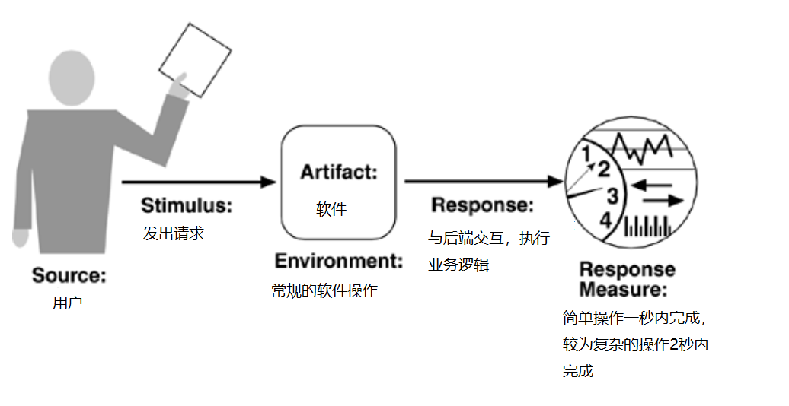
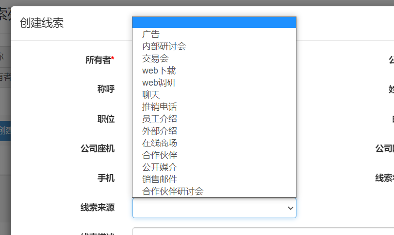
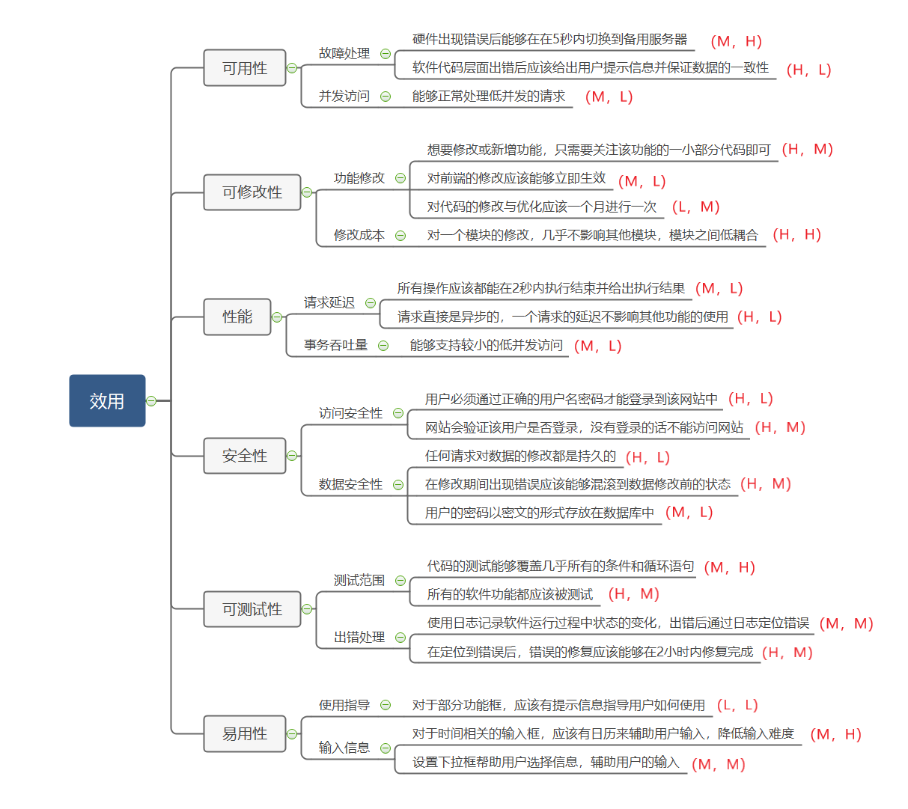

#                         软件体系结构实验报告

## 软件介绍

客户关系管理系统，是一个为企业建立的客户信息收集、管理、分析和利用的信息系统。该系统以客户数据的管理为核心，记录企业在市场营销中和客户发生的各种交互行为，以及各类有关活动的状态，并提供数据统计和分析，为后期的分析和决策提供支持。

本系统的具体功能是客户信息的收集、管理、分析和利用，支持企业活动以及客户信息等方面的增删改查，并包含对其进行统计分析的功能。本软件是基于Java开发的，Java版本需要大于等于JDK9，数据库使用MySQL8.0.22，服务器基于Tomcat8.0.50


## 需求分析

该部分主要对系统的功能性需求和非功能性需求进行需求分析。

### 功能性需求分析

本系统的定位是企业内部的信息管理系统，因此应该部署于企业内部局域网，本系统支持用户的登录，对企业内部的市场活动管理，对企业当前潜在客户信息的管理，对企业当前商业客户的信息管理，对已达成交易的信息管理，对上述基本信息通过统计图表的形式可视化。具体功能如下：

1. **软件构架**：软件能在浏览器中访问，与用户进行可视化的交互，在网页中进行的所有操作应该由服务器处理并写入数据库，达到数据库持久化的目的
2. **登录模块**：用户可以使用账号密码执行登录操作，用户的个人信息应该存储在数据库中，登录失败应该有相应的提示信息，同时软件应该能防止用户的非法登录
3. **市场活动管理**：主要针对企业当前的市场活动而设计，可以创建、修改、删除和查询市场活动列表，查询应支持模糊查询，对于具体市场活动用户具有添加备注的能力
4. **客户与联系人**：客户是与本企业达成交易信息的某一公司，本企业不会与个人达成商业交易，因此客户指的是公司。企业应与公司建立联系，该联系是通过联系人建立的，因此联系人是企业的具体某个人
5. **潜在客户**：本企业可以管理潜在客户的信息，潜在客户是还未达成具体交易但是有发展潜力的客户，这类客户在软件中被称为**线索**客户，因为未达成商业交易，潜在客户指的是某个公司联系人，企业与该人进行联系，以争取达成商业交易。由上述可知，潜在客户对应的是个人信息，而该人是某一公司的联系人代表
6. **潜在客户信息管理**：软件可以创建、修改、删除和查询某一线索客户的信息，同时一个潜在客户应该能关联若干市场活动，表示该市场活动与该潜在客户有关，但是不能关联重复的。如果有交易意向或达成具体的商业交易，软件应该提取潜在客户对应的公司信息，将该公司转化为具体的商业客户，将潜在客户转换成联系人，在转换过程中可以选择是否为该客户创建一笔交易，交易应该选择一个市场活动源作为交易来源，可以是之前关联的，也可以是之前没有关联的，此处创建交易时只需要填写交易的必要信息即可
7. **商业客户信息管理**：软件能够管理具体已达成交易的商业客户，商业客户是某一个公司。软件可以创建、修改、删除和查询某一客户的信息
8. **交易信息管理**：软件可以管理具体的交易信息，交易指的是与某个客户达成的商业交易，因此交易信息需要有对应的客户和联系人，软件能够创建、修改、删除和查询交易信息列表。交易应该有不同的阶段，软件能够对交易进行的不同阶段进行动态管理，同时软件应该能记录交易阶段变化的历史记录
9. **统计图表**：软件应该能够对市场活动、线索和交易进行统计，并在页面中显示可视化的统计图

#### 用例视图建模

根据上述需求，可以得到简单的用例图如下，该图简单概括了用户所有的功能性需求。注意系统管理员对数据的修改应直接通过数据库进行，没有专门为管理员设置的前端管理页面，因此这里的用例图只有公司员工，而其对应的是所有的功能型需求。


#### 逻辑视图建模

该部分针对软件的几个主要功能绘制协作图，阐述功能需求的简单业务逻辑，展现用户和软件的交互关系。需要注意的是，几乎每个模块都有创建、修改、删除和查询功能，他们的实现几乎一模一样，因此这里以市场活动的增删改查为例绘制协作图，其他模块的增删改查功能不再绘制另外的逻辑视图。

1. 用户登录时，需要在登录页面输入用户名与密码，前端页面将登录信息传递给后端业务层，业务层发送查询请求给数据库查询用户信息，如果信息正确就登录成功，返回给用户网页的欢迎页面，如果登录失败就会抛出异常，异常中包含登录失败的原因，该原因将会作为提示信息显示在登录页面。登录过程的协作图如下：


2. 在市场活动页面，选择创建市场活动的按钮，页面会跳转到市场活动的创建页面，用户在创建页面中输入市场活动的基本信息，用户点击提交后，市场活动的信息以表单的形式从前端传递给后端业务层，业务层将信息保存在数据库中，即插入一条市场活动信息。如果信息插入成功，那么会返回市场活动页面给用户，如果插入失败，就会显示失败提示框，向用户展示失败信息。创建市场活动的协作图如下：


3. 在市场活动页面中，选中需要修改的市场活动，选中的该项会首先发送给后端业务层，业务层会从数据库中查询得到该市场活动的详细信息，然后前端会跳转到修改市场活动信息的页面，从数据库中查询得到的详细信息将会铺在修改页面上。用户得到该市场活动的原本信息后进行修改，提交修改后修改信息传递给后端业务层，业务层修改数据库的信息。如果修改成功则返回市场活动页面，如果修改失败就会弹出失败提示框并向用户提示修改失败信息。修改市场活动的协作图如下：


4. 在市场活动页面中，选中需要删除的市场活动，点击删除后会首先弹出提示页面，提示用户是否要删除该市场活动，如果用户确定删除，那么该市场活动的信息将会传递给业务层，业务层会在数据库中删除该市场活动的相应信息。如果删除成功，那么就会返回当前市场活动页面，如果删除失败就会弹出失败信息提示框，并向用户提示失败信息。删除市场活动的协作图如下：


5. 在市场活动页面中输入查询条件，查询条件传递给业务层后，业务层根据当前查询的选项生成相应的SQL语句，在数据库中执行SQL语句后，如果查询成功则将查询结果返回给业务层，业务层将市场活动列表显示在前端页面，如果查询失败则弹出失败信息提示框。查询市场活动的协作图如下：


6. 在线索页面，选中要转换的线索，该线索将传递给后端业务层，后端业务层要首先从线索中提取对应的公司信息，如果当前客户列表中没有该公司，则为该公司创建客户信息，然后从线索中提取联系人信息，将该联系人存储在数据库中，如果线索关联了市场活动，那么就将线索对应的市场活动，转换为联系人对应的市场活动，在全部转换结束后，删除线索与市场活动的关联信息，删除该条线索的信息。上述操作设计大量的SQL操作，任意一个SQL语句出错，程序都会抛出异常并向用户提示错误信息。将潜在客户转换为客户的协作图如下


### 非功能性需求

主要通过软件的可用性、可修改性、性能、安全性、可测试性、易用性来对软件的非功能性需求进行定义。

#### 可用性

可用性关注的是是否发生故障和故障的后果。软件应具备如下可用性需求：

1. 由于软件是基于中小型企业内部开发使用的，软件只需要能承担较低并发的要求即可
2. 在低并发访问的条件下，要求所有功能可用，如果业务失败应该能提示错误信息
3. 软件功能的请求与响应应该是异步的，在一个功能响应的过程中，不影响其他功能的使用
4. 如果数据库操作执行失败，应该能够回滚到执行前的状态，保证数据的一致性
5. 软件在使用的过程中，不应该因为某些问题出现中文的乱码情况


#### 可修改性

可修改性关注的是修改的成本。软件应具备如下可修改性需求：

1. 应只有系统开发人员和系统管理员能够修改系统的某些功能
2. 系统开发人员可以对前端页面、后端业务逻辑进行修改，能够删除或新增业务
3. 修改应该是简单的，即无需了解所有代码，只需了解系统构架就可以完成对系统功能的修改
4. 修改可以发生在软件设计时，也可以发生在软件发布后
5. 修改应该是低成本的，各模块直接相互独立，修改一个模块对其他模块的影响不大


#### 性能

性能的关注点是系统响应事件的速度。软件应具备如下性能性需求：

1. 简单的增删改查任务应该能在1秒内完成
2. 较为复杂的业务逻辑，设计多条增删改查的操作，应该在2秒内完成
3. 能够应对低并发的访问



#### 安全性

安全性关注点是在保证合法用户使用系统的前提下，抵抗外部对系统的攻击。软件应具备如下安全性需求：

1. 对数据库的修改应该是持久的
2. 用户必须登录才能访问网站的资源，不能通过非法方式访问
3. 用户的密码不能以明文的方式存放在数据库中，需要是加密后的密文
4. 通过日志保存记录，进而保证数据的可恢复性


#### 可测试性

可测试性的关注点是让软件的bug尽可能容易被检查到，同时尽可能以最小的成本和工作量完成软件的测试。软件应具备如下可测试性需求：

1. 能够进行单元性的小型测试
2. 对前端页面的修改能直接显示在浏览器中，能够完成前端页面修改后立即测试
3. 通过日志记录软件运行阶段的细节，方便后期bug定位
4. 应尽可能覆盖软件的所需功能需求，所有分支语句与循环语句
5. 对设计阶段、开发阶段、部署阶段分别进行测试，一个阶段测试成功后才能进入下一阶段


#### 易用性

易用性的关注点是让用户使用软件的难度降低。软件应具备如下易用性需求：

1. 软件在部分功能上有提示信息指导用户的使用
2. 部分选项应设置下拉框方便用户选择
3. 与时间相关的输入应使用日历模块来方便用户输入
4. 功能出错应该有相应的提示信息，告诉用户执行失败的原因


## 软件设计

该部分将首先分析软件的体系架构，体系构架主要对标软件的功能性需求，以完成用户的功能需求为主。之后分析软件为了满足非功能性需求所做的部分改进，非功能性需求几乎不影响已实现的功能性需求，主要是对软件细节的补充。最后我们会补充一些软件设计中其他的一些架构设计

### 功能性需求设计

首先我们分析软件的功能性需求，选择合适的体系结构风格，来完成对软件的整体设计。该部分混合使用多种体系风格，以完成功能需求为目的，而很少关心软件优化方面的问题

#### 整体架构

从需求中可以看到，该软件是部署于服务器上，通过浏览器访问的，因此整体的架构设计应该满足B/S框架。传统的MVC模式将软件分为三大组件：视图、模式和控制器。视图主要以可视化的方式展现给用户，与用户进行交互；模式是后台的服务程序，主要处理软件的功能和业务逻辑，暴露出功能接口，具体实现由模式内部的代码负责；控制器则用来协调视图与模型，相当于一个中介，控制器接收前端的输入，将输入以合适的形式传递给后端，例如Java对象，同时控制器接收后端返回的结果，以前端能够处理的形式传递给前端页面，例如Json对象。MVC模式实现了层次之间的解耦，前端页面只需负责前端的交互，而无需知道业务是怎么处理的，后端程序只需要接收传递的输入，给出结果输出即可，控制器只做数据格式的转换，而对前后端的具体性都不关心。

然而当我们使用数据库存储数据时，传统的MVC模式就会暴露出响应的弊端，按照MVC模式的设计，模式用于处理业务逻辑，而当后端连接到数据库时，模式就还需要处理与数据库交互的相关细节，这会使模式变得臃肿，耦合性增强。因此我们修改传统的MVC模式，使用当今市面上比较流行的五层构架：

1. 用户页面层（web层）：相当于MVC模式中的视图模块，以web页面的方式向用户展示页面信息，与用户进行业务的交互
2. 控制层（controller层）：相当于MVC模式中的控制器，接收前端的数据以恰当的形式传递给后端，同时把后端的数据以恰当的格式返回给前端，起到中间协调的功能
3. 业务层（service层）：相当于MVC模式中的模式，处理具体的业务逻辑，完成软件的功能需求
4. 数据持久化层（dao层）：负责与数据库的交互，执行数据库链接、sql语句的生成等功能，完成数据持久化的需求
5. 数据库：管理数据，保证数据持久化


对于上述软件的整体构架，我们应该重点关心业务层和数据持久化层的实现，因为用户页面只负责展示交互的接口，很少具体功能的设计，控制层只负责数据中介的转换和方法的调用，数据库使用已有的MySQL数据库就足够了，因此我们应该重点关心余下的两层，也就是具体业务功能的模块。

#### 过滤器体系风格

过滤器体系结构风格是数据流风格的一种，过滤器描述的是数据流与数据流的变化，一般有五种类型：通过计算和增加信息来丰富数据；通过浓缩和筛检信息来精炼数据；通过改变数据的表现形式来转化数据；将数据流分解为多个数据；将多个数据流合并为一个数据流


显然过滤器风格非常适合控制层的设计。控制层的定位是接收前端数据，将前端数据整合成业务层所需的数据格式，然后将数据发送给业务层；同时接收业务层处理的结果输出，将结果输出以前端能够处理的格式返回给前端代码。控制层相当于一个双向的过滤器，通过改变数据表现方式来转换数据。

#### 调用/返回体系风格

调用/返回风格是非常场景的一种体系结构风格，该风格下的子风格几乎都可以用在本次软件的设计中，以满足各种功能性需求。

该软件的设计使用了大量的主程序/子程序风格，该风格可以将比较复杂的业务逻辑分发给许多子程序完成，每个子程序完成一部分，子程序由主程序调用，最后统一将结果返回给主程序，从而完成一个比较复杂的业务逻辑。

我们以登录为例说明主程序/子程序风格的使用。在登录功能中，主程序相当于控制层的login函数，login函数调用子程序来完成登录的功能。首先调用密码转换子程序，传入从前端接收到的明文密码，转换为加密后的密文密码，然后将用户名与密码传递给业务层的login函数。业务层的login函数会将用户名与密码封装成一个map，将这个map传递给Dao层的login函数，Dao层的login函数取出map中的信息，生成sql语句在数据库中查询。如果查询到相应的用户，数据库将返回用户的信息，Dao层将用户信息封装成一个对象，把对象返回给业务层的login函数，业务层的login函数将该对象返回给控制层的login函数；如果没有查询到该用户，则会返回一个null，Dao层会继续将这个null传递给业务层，业务层收到null后会初始化一个登录异常的对象，抛出异常给控制层的login函数。控制层调用Json转换函数，如果收到的是用户对象，就将该对象包装成Json；如果收到的是异常，则从异常中提取异常信息，将该信息封装成Json


面向对象体系风格也是调用返回风格中重要的一个子风格。由于我们使用的是Java开发，Java本身就是面向对象的语言，因此程序几乎处处都是以对象的形式进行交互。举例说明，我们针对数据库中的每一个关系，都建立了一个与之一一对应的类，该类的私有字段与数据库关系中的属性都一一对应，这是为了方便我们的对象操作。我们使用SQL语句查询数据，一般都会返回一个或多个元组，如果是一个元组，我们就把这个元组封装成与该关系对应的对象，我们可以从该对象中提取属性信息；如果返回的是多个元组，我们可以封装成一个列表，可以遍历列表一一取得每一个对象执行相应的操作。

层次结构和客户端/服务器风格都是调用/返回体系风格中的子风格，从整体构架部分可知，该软件是分层设计的，各层之间相互调用，软件基于客户端/服务器开发，在网页中与用户交互，在服务器中处理具体业务，对此不再过多叙述。

#### 仓库体系风格

仓库体系风格是以数据为中心的体系结构风格中一个重要的子风格，用于处理应用于公共数据交互的问题。显然我们的软件是使用了仓库体系风格，中心数据机构是数据库，保存了我们用到的所有数据，其他与数据库数据交互的所有业务都是独立的构建，简单的示意图如下。


### 非功能性需求设计

该部分将针对已有的体系风格做出调整，对系统进行优化，以满足软件的非功能性需求。对系统的优化不影响以确定的整体框架，也不会影响已实现的业务逻辑。

#### 可用性

软件需要满足低并发的访问，因此服务器管理程序使用Tomcat是一个很好的选择。Tomcat服务器是一个免费的开源Web应用服务器，是一个轻量级应用服务器，我们在开发中使用的是Tomcat8.0.50，这是性能相对比较稳定的一个版本。由于Tomcat是Apache和Sun公司联合开发的，它对Java程序的适配性非常好，选择Tomcat服务器是一个较好的选择。

为了在业务失败时都能有提示信息，我们对于每一个请求，都会单独编写任务失败的条件分支，当任务失败时，前端页面会弹出一个alert弹窗，提示用户操作失败。在后端，我们用自定义异常的方式，为可能出现错误的部分定义一个异常，如果出现错误就抛出该异常，异常的信息就是错误的提示信息。

可用性需求中，要求软件的功能请求与相应是异步是，一个功能响应的过程中，页面应该是可以操作的，而不是卡死的。因此我们使用的前端请求方式均是ajax请求。ajax请求是一种异步请求，使用方式简单易学，能很好的满足可用性的需求，它的简单使用格式如下。

~~~JavaScript
$.ajax({
    url : "请求的url",
    data : {
        //对于该请求需要传递的参数值，以键值对的形式传递
    },
    type : "get/post",
    dataType:"json",    //后端返回的数据格式，一般都是json
    success : function (data){
			//后端相应后的回调函数，data是后端传来的数据
    }
})
~~~

可用性要求如果数据库操作异常，应该是能够回滚的，失败时要保证数据的一致性。针对该需求我们使用了SQL中事务的概念，我们针对每次业务功能做事务的封装，通过SQL自身的事务功能，达到维护数据一致性的目的。同时我们还可以利用MySQL的日志系统，通过记录日志来记录MySQL执行的各种操作，这也有助于我们在发生错误后恢复系统状态，查找错误原因。

在java开发中，对于前端的请求，和后端的响应，往往对中文的支持并不好，很容易传递过程中出现中文乱码问题，乱码会导致用户无法正常使用软件，甚至可能导致数据的损坏，因此我们需要解决数据乱码问题。我们需要对前后端所有的响应请求做过滤，用过滤器来设置编码格式为UTF-8，这也是过滤器体系风格的一种体现。具体的实现如下，我们继承Java自带的过滤器类，然后重写doFilter方法，对前后端的请求与相应设置编码格式，最后放行即可

~~~java
public class EncodingFilter implements Filter {
    @Override
    public void init(FilterConfig filterConfig) throws ServletException { }
    @Override
    public void destroy() { }
    @Override
    public void doFilter(ServletRequest req, ServletResponse resp, FilterChain chain) throws IOException, ServletException {
        req.setCharacterEncoding("UTF-8");
        resp.setContentType("text/html;charset=utf-8");
        chain.doFilter(req, resp);
    }
}
~~~

#### 可修改性

为了让软件的修改更简单，我们在控制层使用了一种模板来接收前端的请求。前端的请求是以url定位到后端的，首先会被控制层接收到该请求，控制层可以获取到请求的url，通过匹配url来执行相应的功能函数，简单的程序架构如下：

~~~java
String path = request.getServletPath();

if("功能1的url".equals(path))
{
    功能1对应的函数(request, response);
}
else if("功能2的url".equals(path))
{
    功能2对应的函数(request, response);
}
else if("功能3的url".equals(path))
{
    功能3对应的函数(request, response);
}
//... 更多的else if分支

  
功能1的函数 (HttpServletRequest request, HttpServletResponse response) 
{
    函数的具体功能实现...
}
功能2的函数 (HttpServletRequest request, HttpServletResponse response) 
{
    函数的具体功能实现...
}
功能3的函数 (HttpServletRequest request, HttpServletResponse response) 
{
    函数的具体功能实现...
}
//...更多功能对应的函数
~~~

在这种构架之下，如果想要修改某一功能，直接定位到对应控制层的函数即可，如果想要添加某一功能，只需要在前端发出请求，在控制层新增一个if-else分支，将该请求定位到某个业务功能函数，编写对应功能函数即可。使用这种方法添加或者修改某一功能将变得很简单，无需阅读其他功能的代码，实现了各功能模块直接相互独立的目的。

 除此之外我们在该项目中使用了配置文件技术来完成某些功能。例如在数据库链接的过程中，我们编写jdbc.properties配置文件，在配置文件中设置数据库的用户名、密码、url、驱动等数据库链接信息，这样当我们想要更换数据库时，只需要修改jdbc.properties配置文件，就可以轻松更换数据库，而无需修改任何业务逻辑的代码。

#### 性能

我们从软件对资源的需求角度来提高服务器的性能。为了减少服务器的响应时间，我们使用服务器缓存来缓存一小部分频繁使用的数据，从服务器缓存中取出数据显然是比从数据库中查询一遍要快的

用一个例子来说明，如下图所示，在创建时，我们需要选择称呼的选项，显然称呼是需要经常用到的，而且只有五条记录，如果从数据库中查询一遍是很不划算的，因此我们可以考虑在服务器启动时就从数据库中把这些信息加载在服务器缓存中，这样当我们点击创建按钮时，我们只需要将数据从服务器缓存中取出，放在表单里即可


我们把这种数据成为数据字典，我们在数据库中建立两个关系，如下图所示，一个关系描述的是数据字典的类型，而另一个关系描述的是数据字典的值，两个关系通过一个外键建立对应的关系，一个数据字典类型能对应多个数据字典的值，而一个值只能对应一个类型，这是一对多的关系。


#### 安全性

我们需要保证数据是持久的，这一点可以通过数据库保证。

我们还需要保证用户必须登录后才能访问网站，不能通过非法的方式访问。举例来说，正常访问会先跳转到```http://ip:port/CRM/workbench/login.jsp```，登录后进入```http://ip:port/CRM/workbench/index.jsp```，而如果我们不登录，直接输入```http://ip:port/CRM/workbench/index.jsp```网址，是否也能进入到该网站呢？我们需要放着这种情况的发生。一般的处理流程是我们编写一个过滤器，过滤除了登录相关url之外的所有url，在过滤器中我们首先检测当前服务器的Session域中是否保存有用户信息，如果有，则说明在该次会话中用户是登录了网站的，放行url请求即可，如果没有，则说明用户没有登录网站，使用重定向直接返回到登录页面即可


数据库中存放着用户的信息，显然密码不能以明文的方式存在，否则一旦数据库中的数据泄露，用户的账户将会被盗取，这里我们使用密文存放用户的密码，即将密码通过MD5加密，将加密后的密文存放在数据库中，进而保证了用户账号的安全性

最后日志功能我们使用了两种方式实现。MySQL数据库是自带日志信息的，它可以为我们记录数据库的变化过程，以此作为我们恢复数据的基准。同时我们还使用了log4j，log4j是Apache的一个开源项目，它可以输出服务器的日志信息，我们可以选择日志信息输出的位置，可以是控制台，也可以是本地文件，还能选择日志文件的精细程度，同时log4j是通过配置文件配置的，具有很好的可修改性。

除此之外，我们还进行了一些其他提高安全性的措施。

1. 软件的定位是部署于局域网，因此局域网本身就为我们提供了一种保护，限制了外部对该网站的访问。
2. 我们为每个用户设置了失效时间字段，该字段存储一个时间信息，我们每次登录会验证该时间信息，如果该时间小于当前时间，那么就说明该用户已经失效，不能再访问网站了。
3. 我们为每个用户设置了锁定状态字段，用0和1表示，我们可以锁定一些用户，控制用户的访问，这也相当于控制了用户访问权限

#### 可测试性

我们增添了很多可以提高可测试性的细节。

1. 首选我们在开发中服务器选择了热部署，对前端资源的修改能够马上反映在网页上，我们可以边修改前端的属性，边观察修改效果，提高前端的开发效率
2. 我们使用的log4j日志文件能够记录后端响应的流程，如果出现错误，通过log4j也能观察到出错的原因，这有助于我们寻找bug
3. 我们使用JUnit测试单元来支持软件的单元测试，我们建立了专门的测试文件夹，在里面编写测试代码，对每一个代码模块进行模块化的测试
4. 每当我们完成一个模块的编写，我们就会对其的功能进行测试，该模块准确无误后，我们才会转向下一个模块的开发

#### 易用性

我们在一些选项的细节方面，提高了软件的易用性。

1. 在软件的一些部分，我们设置了一些提示信息用于辅助用户的使用与功能理解


2. 我们设置了很多下拉框，能够帮助用户更高效的填写表单信息



3. 我们设置了日历模块，通过选择日历模块的日期，可以规范用户的日期输入，通过提高用户体验效果


4. 当我们填写一些条目不多的表单时，我们使用模态窗口开让用户填写信息，而不会跳转到一个页面，因为表单项目很少，跳转到一个页面会弱化用户的体验感


5. 对于信息的显示，我们使用了分页插件，利用分页插件，用户可以更容易的查看数据。分页插件可以查看每一页的数据，可以跳转到末页或首页，还可以指定跳转到某一页，还能选择一页显示多少条记录，最后有对所有记录数量的统计信息。


### 软件的其他设计细节

除了针对功能性需求和非功能性需求的分析外，我们在开发过程中使用了一些其他技巧与设计架构，来让软件尽可能达到高内聚低耦合的目的，该部分将对上面没有提到的架构设计予以简单阐述

#### mybatis框架的使用

MyBatis原本是Apache的一个开源项目ibatis，2010年这个项目由apache software foundation迁移到了google code，并且改名为MyBatis。 MyBatis是一个优秀的持久层框架。它对jdbc几乎所有的数据库操作进行了封装，使开发者只需要关注SQL本身。

使用Mybatis后我们将不用再手动编写繁琐jdbc代码，搭建好框架后我们在对应的xml文件中，直接编写SQL语句即可，Mybatis会帮助我们完成数据库的连接、SQL语言的传递，甚至可以对查询结果进行封装，以对象或者map的形式返回给调用端

这实现了Java代码和数据库的解耦。我们不需要在Java代码中拼接SQL语句，在Java中我们关心的只有如何通过Java实现复杂的业务逻辑，而无需关心如何进行查询；在xml配置文件中，我们不用关心数据如何与Java交互，如何与数据库交互，只需要编写SQL语句即可。同时因为我们使用的是配置文件编写SQL语句，我们的可修改性提高了，代码的可阅读性也提高了

#### 工具类的使用

本次开发过程中，许多功能是需要重复使用的。例如我们在数据库中插入元组时，我们需要生成它的主键，而主键应该被统一管理，保证它的唯一性，因此我们需要确定一个主键的生成方法，每次都调用这个方；我们需要在很多地方使用到时间，最常见的是插入元组时，经常需要生成创建时间字段，获取时间是一个频繁使用的重复操作；我们每次向前端传递信息时，都需要使用Json，因此我们需要把后端的数据转换成Json的形式传递给前端，这是频繁使用的功能

如上所述，我们建立了许多工具类，在工具类里面使用静态方法定义上述功能，进而将这些功能与Java的业务代码剥离开，因为使用了静态方法，我们只需要通过类名调用这些方法即可，简化了开发流程，提升了代码的内聚度

#### 代理的使用

如前所述，我们为了保证数据的一致性，需要对每次业务功能做事务的封装，业务层的调用是控制层负责的，这就要求每次控制层调用业务时，都要对该业务方法执行事务的提交操作，这无疑是繁琐的，而且控制层不应该去管理数据库的事务相关特性，这不符合低耦合的原则。

我们使用了一个动态代理机制，该机制是基于反射的，通过反射代理每一个被调用的功能，通过代理我们可以为该方法进行事务的封装。也就是说，我们专门为数据库的事务建立了一方法，该方法处理所有事务的提交操作。同时该方法提高了软件的可修改性，如果我们想要在业务方法上附加一些限制功能，或者扩展一些其他辅助功能，我们都可以通过该动态代理类添加，而无需在每一次调用业务方法时添加。本次使用动态代理的核心代码如下。

~~~java
@Override
public Object invoke(Object proxy, Method method, Object[] args) throws Throwable {
    SqlSession session = null
    Object obj = null;
    try{
        //通过工具类获取SQL链接
        session = SqlSessionUtil.getSqlSession();
        //通过反射调用被代理的业务方法
        obj = method.invoke(target, args);
        //提交事务
        session.commit();
    }catch(Exception e){
        //如果出错，事务回滚
        session.rollback();
        e.printStackTrace();
        //向上抛异常，因为这里是代理类，不是真正应该处理异常的类
        throw e.getCause();
    }finally{
        SqlSessionUtil.myClose(session);
    }
    return obj;
}
~~~


## ATAM体系结构评估

在上面的叙述中，我们已经介绍了软件的商业动机、体系结构、确定核心体系结构的方法，因此这里需要对软件建立效用树，识别并记录软件的风险、非风险、敏感点和权衡点

效用树主要针对软件的质量属性进行场景的建模与评估，我们以软件的质量属性需求为基础，建立了如下的效用树。



根据以上评估，我们可以得到如下的风险、非风险、敏感点和权衡点：

1. **风险**：软件可能受到短时间的高并发访问，Tomcat是一个轻量级的服务器，可能会因此出现服务器崩溃的问题；测试所有的分支和循环语句是困难的，可能有些代码没有被测试到；模块之间低耦合是困难的，修改一处可能会隐式的影响其他部分的代码，进而影响其他功能；前端页面使用的jsp页面而不是html页面，因此前端与后端并未严格分离开，有一定的耦合度，可能导致后续修改的困难
2. **非风险**：数据库使用密文存储密码，保证了账户的安全性；提供下拉框、日历模块，在部分位置提供帮助信息指导用户的使用；使用日志记录软件的历史信息，帮助软件bug的检测与数据的恢复；通过过滤器保证用户必须登录才能进入网站内部
3. **敏感点**：如果要修改整体前端页面的主题风格，或者新增前端模块，很可能会对当前整体前端的布局产生影响；配置文件的编写是繁琐的，如果某一部分编写错误，会导致功能出错，甚至服务器无法启动的现象
4. **权衡点**：数据库使用密文存放用户密码，但是密文的长度更长，影响了查询和插入数据的性能；为了限制访问，可以为每一个用户配置访问的ip，通过检测该ip是否匹配该用户来授权用户的访问，这样能大大提高安全性但检测ip是困难的，尤其是使用DHCP动态地址后，ip地址会发生变化，因此只使用了局域网来限制访问；log4j的日志记录有详细等级的区分，太详细则很难在出错时定位到错误，过于简略就失去了其作为日志的价值，需要选择合适的详细等级

根据上述分析，结合效用树，我们可以确定软件场景：

**可用性**

1. 如果硬件出现错误应该能够在5秒内切换到备用服务器
2. 软件代码层面出错后应该给出用户提示信息并保证数据的一致性
3. 能够正常处理低并发的请求
4. 软件只有在局域网内是可用的

**可修改性**：

1. 想要修改或新增功能，只需要关注该功能的一小部分代码即可
2. 对前端的修改应该能够立即生效
3. 对代码的修改与优化应该一个月进行一次
4. 对一个模块的修改，几乎不影响其他模块，模块之间低耦合
5. 使用xml配置文件和properties属性文件来记录配置信息
6. 将sql语句单独集成在xml文件中，修改sql语句只需要关注sql语句，无需关心Java代码

**性能**：

1. 所有操作应该都能在2秒内执行结束并给出执行结果
2. 请求直接是异步的，一个请求的延迟不影响其他功能的使用
3. 能够支持较小的低并发访问
4. 下拉框的部分选项直接存储在服务器内存中，提高访问速度

**安全性**：

1. 用户必须通过正确的用户名密码才能登录到该网站中
2. 网站会验证该用户是否登录，没有登录的话不能访问网站
3. 任何请求对数据的修改都是持久的
4. 在修改期间出现错误应该能够混滚到数据修改前的状态
5. 用户的密码以密文的形式存放在数据库中

**可测试性**：

1. 代码的测试能够覆盖几乎所有的条件和循环语句
2. 所有的软件功能都应该被测试
3. 使用日志记录软件运行过程中状态的变化，出错后通过日志定位错误
4. 在定位到错误后，错误的修复应该能够在2小时内修复完成
5. 能够对单个组件，单个功能单元进行测试

**易用性**：

1. 对于部分功能框，应该有提示信息指导用户如何使用
2. 对于时间相关的输入框，应该有日历来辅助用户输入，降低输入难度
3. 设置下拉框帮助用户选择信息，辅助用户的输入
4. 设置模态窗口，对于小型表单的填写使用模态窗口，大型表单的填写跳转网页
5. 信息展示的页面都有分页插件，对信息进行分页显示


## 软件测试

### 登录模块

登录页面：


登录失败的测试：


登录后进入的页面首页：


### 市场活动页面

市场活动页面：


市场活动详细信息页面：


创建市场活动：


查询市场活动：


修改市场活动：


删除市场活动：


### 线索页面

线索页面：


线索详细信息页面：


对线索关联市场活动：


线索转换：


### 客户模块

客户页面：


客户详细信息页：


### 交易模块

交易页面：


动态更改交易的阶段：


### 联系人模块

联系人页面：


联系人详细信息页：


### 统计图表


